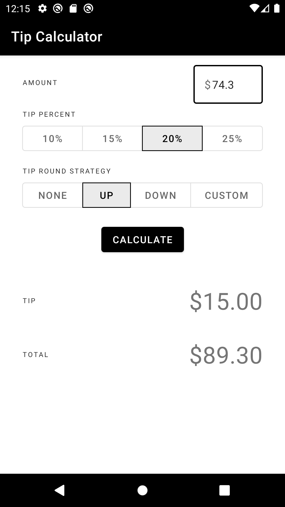
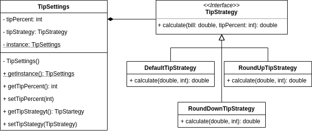

# Tip Calculator
COMP 730/830 Lab 3

## Objectives
- Learn how to use and implement Singleton Design Pattern
- Learn how to use and implement Strategy Design Pattern

## Instructions
1. Tip calculator has global settings stored in `TipSettings` object. Because of that, we want to 
insure that the app has only one single instance of `TipSettings` class. Singleton Design Pattern 
   solves that problem. Turn `TipSettings` into Singleton class. Refer to the class diagram below as a guide.
   You may also want to update `MainActivity` to make sure that it uses the single instance of `TipSettings`.
   
   

2. All tip strategy algorithms are implemented in the `MainActivity`. It makes them very difficult to reuse
   and keep consistent among other clients that could use them. Strategy Design Pattern solves that problem.
   Implement tip strategy algorithm using Strategy Design Pattern. Refer to the class diagram below as a guide.
   You may also want to update `TipSettings` and change type of the `tipStrategy` variable to `TipStartegy`.

   

3. Add custom tip strategy. The custom tip button is already there for you. Add new implementation 
of `TipStartegy` interface to calculate your own tip strategy (it can be anything you want). Apply
   your custom strategy when button with id `R.id.custom` was selected. 